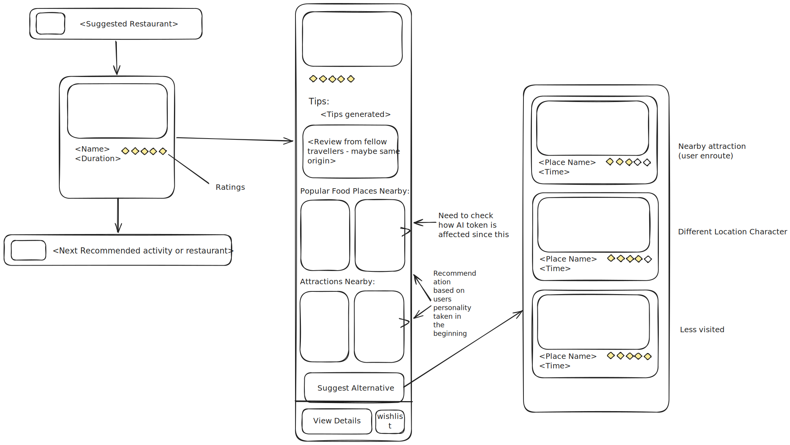

# Design for Alternative Activity Suggestion

This is the doc for the `alternative activity suggestion` in the Itenary design by Aditya Puranik as part 2 of round 1 of interview

Platforms available - PC(across + downward motion) && Phone(downward only motion)

This itenary will accessed majorly on the phone (continous transit of the user during vacation)

## Problem:
TO DESIGN A FLOW FOR THE USER TO GET ALTERNATIVE ACTIVITES AS SUGGESTIONS AND NOT TO BREAK THE CURRENT FLOW WHILE MAINTAINING THE THEME

## Users:
- Extreme explorers - priortise to watch/tour the most when in a new place or on vacation(will be called as 'activities' from now)
- Mild explorers - priortise activites as well making sure they are not fatigued by excess touring. - Family in most cases
- Kickbacks - Will not priortise activites will prefer to stay at accommodation than explore

**We will concentrate on the first two users - as these user base will require the service more**

1. We will first ask the question does the user want to switch ?
In most cases the user will be curious about a place and cannot possibly know well about a place to consider whether he wants to skip/search alternative.
We also need to consider the user will be on the move so the data provided should be enough to make a decision

2. What will the user consider before switching an activity with another ?
- In this case we need to consider that the user is not looking to switch

